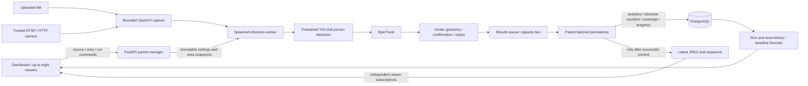
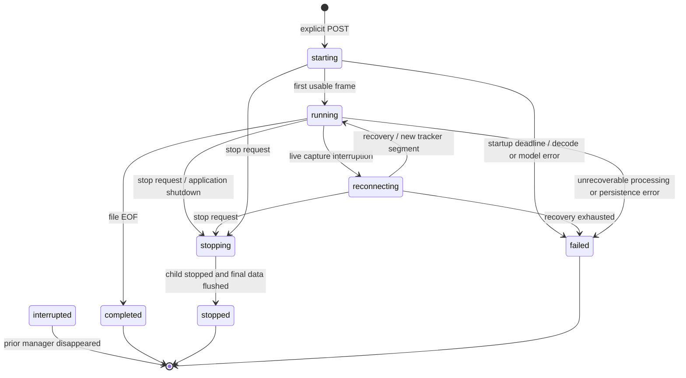

# Architecture and data ownership

One FastAPI process supervises one active producer on one host. A PostgreSQL
session advisory lock prevents a second manager owning the same database.
Model throughput and GPU memory must be measured before increasing concurrency.

## Process boundary

The child owns capture, one model, one tracker, counting state, and JPEG encoding.
It receives plain data and sends plain result packets; it does not create a
SQLAlchemy session or import the web application. File processing uses queue
backpressure rather than silently dropping analytics. The parent owns database
writes, run lifecycle, and viewer fanout. Slow viewers skip images and cannot
create another tracker or block the producer's inference state.

Uploads and inactive previews use separate bounded spawned decode probes without
YOLO. Active previews reuse the shared JPEG. Preview, area mutations, and run
startup share a mutation guard so a preview cannot open a camera while its
producer starts, and an area edit cannot race the run snapshot.

## Durable records

| Table | Responsibility |
| --- | --- |
| `video_sources` | File/live URI, sanitized display name, decoded file metadata. |
| `areas` | Source polygons and enabled state for future runs. |
| `processing_runs` | Immutable effective settings/area snapshots, lifecycle, ownership, frame and timing progress. |
| `detections` | Normalized person boxes, optional tracker identity, run/frame/segment and observation timestamps. |
| `events` | Observed enter/exit transitions for one run, segment, track, and area. |
| `run_area_stats` | Absolute enter/exit totals, observed presence, and lost-track counters. |
| `frame_samples` | Explicit timeline coverage and per-area occupancy snapshots. |
| `run_buckets` | Transactional minute coverage, weighted occupancy, and traffic summaries for bounded history queries. |

Additive Alembic revisions preserve the original two migrations and legacy
records. Legacy detections/events retain null run identity; no run provenance is
invented. New detection/event keys make retries idempotent. A partial unique
index prevents multiple active runs for one source. Absolute counter snapshots
avoid double increments when an ambiguous commit is retried.
Minute summaries commit with their audit frames and counters. Migration backfill
counts overlapping older intervals once, preserving gaps. History defaults to
the latest 120 minutes; explicit ranges support up to 10,000 output buckets.

The parent batches analytics, counters, coverage, and progress in one transaction.
It publishes the corresponding frame only after commit. Database writes retry a
bounded number of times; exhausted retries stop/fail processing. Startup marks
abandoned active runs interrupted after obtaining manager ownership.

## Lifecycle and discontinuities

Replays create new runs. Camera recovery increments the tracker segment and
clears presence, preserving cumulative run traffic/loss totals. No synthetic
exit is generated by track loss, reconnect, EOF, viewer detach, or shutdown.
Stop signals the child immediately; an independent guardian terminates a
blocked child after five seconds, even while database writes stall. Viewer detach
does not stop the producer, and quiet footage does not trigger an idle watchdog.

## Counting and time

Coordinates are normalized; box centers determine membership and polygon
boundaries are outside. Three consecutive processed observations confirm
membership or transitions. Initial inside confirmation establishes occupancy
without an enter. Missing processed observations reset pending streaks. An
unseen confirmed-inside track expires after more than two source seconds,
reducing occupancy and incrementing loss telemetry without an exit.

Files use elapsed media seconds and retain server-observed UTC separately. Live
sources use server-observed UTC for history; it is not sensor exposure time.
Tracker IDs identify a run/segment trajectory, not a globally identified person.

Current occupancy is available only for fresh running observations. Historical
entry minus exit flow can differ from occupancy and may be negative. History
requires explicit coverage: covered complete zero-traffic buckets are zero;
gaps and partial buckets are unavailable.

Forecasting selects one run and area. Twenty complete contiguous observed minute
buckets are required. Last-value and EWMA alpha 0.3 compete independently for
entries/exits using chronological rolling five-step MAE after ten training
minutes. Ties prefer last-value. Predictions assume recent rates continue, with
no calibrated intervals. File forecasts describe hypothetical media continuation.
Live forecasts require a fresh running observation; outages cannot produce a
current forecast from stale history.

## Deployment boundary

The Compose application image uses CPU PyTorch and one Uvicorn process. It waits
for PostgreSQL health, applies migrations, and binds published ports to loopback.
GPU execution uses a host environment with the matching PyTorch CUDA wheel.
This trusted local application permits LAN/loopback cameras and does not provide
authentication, a multi-host scheduler, or arbitrary public deployment isolation.
